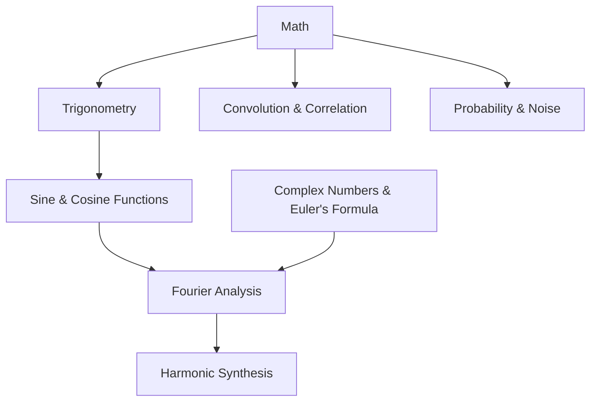

```mermaid
flowchart TD
    M[Math]
    T[Trigonometry]
    S[Sine & Cosine Functions]
    CN[Complex Numbers & Euler's Formula]
    F[Fourier Analysis]
    H[Harmonic Synthesis]
    CC[Convolution & Correlation]
    PN[Probability & Noise]
    
    M --> T
    T --> S
    S --> F
    CN --> F
    F --> H
    M --> CC
    M --> PN
```